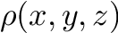
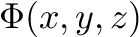
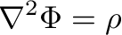
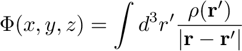
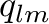
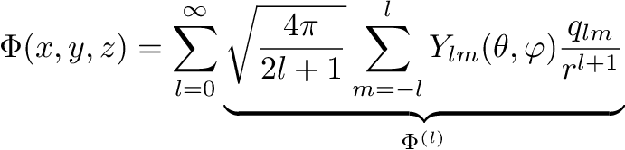
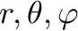
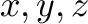
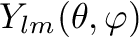
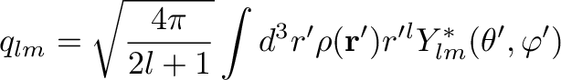

[](https://badge.fury.io/py/multipoles)

# multipoles

*multipoles* is a Python package for multipole expansions of the solutions of the Poisson equation (e.g. electrostatic or gravitational potentials). It can handle discrete and continuous charge or mass distributions.

## Background

For a given function , the solution  of the Poisson equation  with vanishing Dirichlet boundary conditions at infinity is



Examples of this are the electrostatic and Newtonian gravitational potential.
If you need to evaluate  at many points, calculating the integral for each point is computationally expensive. As a faster alternative, we can express  in terms of the multipole moments :



where  are the usual spherical coordinates corresponding to the cartesian coordinates  and  are the spherical harmonics.

The multipole moments are:



This approach is usually much faster because the contributions  are getting smaller with increasing <i>l</i>. So we just have to calculate a few integrals for obtaining some .

## Examples

### Discrete Charge Distribution

As example for a discrete charge distribution we model two point charges with positive and negative unit charge located on the z-axis:

```python
from multipoles import MultipoleExpansion

# Prepare the charge distribution dict for the MultipoleExpansion object:

charge_dist = {
    'discrete': True,     # point charges are discrete charge distributions
    'charges': [
        {'q': 1, 'xyz': (0, 0, 1)},
        {'q': -1, 'xyz': (0, 0, -1)},
    ]
}

l_max = 2   # where to stop the infinite multipole sum; here we expand up to the quadrupole (l=2)

Phi = MultipoleExpansion(charge_dist, l_max)

# We can evaluate the multipole expanded potential at a given point like this:

x, y, z = 30.5, 30.6, 30.7
value = Phi(x, y, z)

# The multipole moments are stored in a dict, where the keys are (l, m) and the values q_lm:
Phi.multipole_moments
```

### Continuous Charge Distribution

As an example for a continuous charge distribution, we smear out the point charges from the previous
example:

```python
from multipoles import MultipoleExpansion
import numpy as np

# First we set up our grid, a cube of length 10 centered at the origin:

npoints = 101
edge = 10
x, y, z = [np.linspace(-edge/2., edge/2., npoints)]*3
XYZ = np.meshgrid(x, y, z, indexing='ij')


# We model our smeared out charges as gaussian functions:

def gaussian(XYZ, xyz0, sigma):
    g = np.ones_like(XYZ[0])
    for k in range(3):
        g *= np.exp(-(XYZ[k] - xyz0[k])**2 / sigma**2)
    g *= (sigma**2*np.pi)**-1.5
    return g

sigma = 1.5   # the width of our gaussians

# Initialize the charge density rho, which is a 3D numpy array:
rho = gaussian(XYZ, (0, 0, 1), sigma) - gaussian(XYZ, (0, 0, -1), sigma)


# Prepare the charge distribution dict for the MultipoleExpansion object:

charge_dist = {
    'discrete': False,     # we have a continuous charge distribution here
    'rho': rho,
    'xyz': XYZ
}

# The rest is the same as for the discrete case:

l_max = 2   # where to stop the infinite multipole sum; here we expand up to the quadrupole (l=2)

Phi = MultipoleExpansion(charge_dist, l_max)

x, y, z = 30.5, 30.6, 30.7
value = Phi(x, y, z)
```

## Installation

Simply use `pip`:

```
pip install multipoles
```

## Dependencies

`multipoles` uses `numpy` for fast array processing and `scipy` for support of spherical harmonics.
